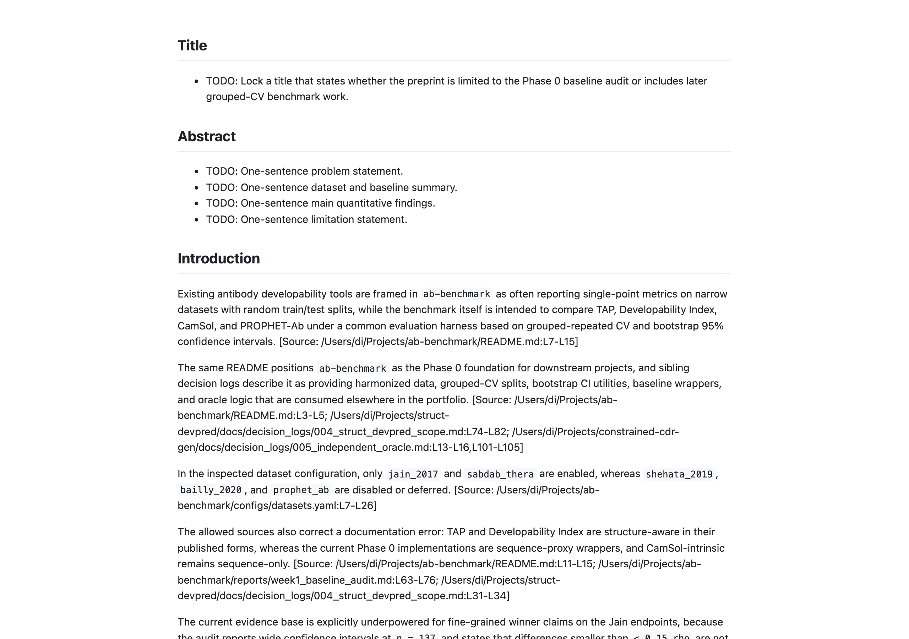

# ab-benchmark

**Screenshot**


**Problem** Antibody developability baselines are hard to compare because they are usually reported on narrow datasets and inconsistent splits. The field needs a shared benchmark that harmonizes sources, preserves provenance, and evaluates common baselines under one leakage-resistant harness.

**Approach**
- Harmonize source datasets into canonical long and wide antibody tables with row-level provenance.
- Expose TAP, Developability Index, CamSol-intrinsic, BioPhi/OASis, DynaMine, CABS-flex, and PROPHET-Ab through one baseline interface.
- Use grouped evaluation utilities and bootstrap confidence intervals instead of random-split reporting.
- Return explicit unavailable-baseline records with blockers instead of silently dropping methods.

**Key results**
- Phase 0 harmonization produced 1,243 records and 1,106 unique antibodies, with 137 antibodies appearing in at least two sources and clearing the stated `n >= 400` target. [Source: /Users/di/Projects/ab-benchmark/reports/week1_baseline_audit.md]
- The audit registered 7 baselines; 3 were available in Phase 0 and 4 were deferred with explicit environment, cache, structure, or embedding blockers. [Source: /Users/di/Projects/ab-benchmark/reports/week1_baseline_audit.md]
- On Jain HIC retention time, `tap_cdr_net_pos_count` reached Spearman `rho = -0.30` with bootstrap 95% CI `[-0.45, -0.14]`, while `di_seq_proxy` reached `rho = +0.25` with CI `[+0.09, +0.40]`. [Source: /Users/di/Projects/ab-benchmark/reports/week1_baseline_audit.md]
- No baseline metric reached a confidence interval excluding 0 for Tm or HEK expression at `n = 137`, which the repo treats as an honest negative result rather than a winner claim. [Source: /Users/di/Projects/ab-benchmark/reports/week1_baseline_audit.md]
- The current package passed 99/99 tests at 71% coverage against a 70% threshold. [Source: /Users/di/Projects/ab-benchmark/reports/week1_baseline_audit.md]

**Reproduce**
```bash
python3 -m venv .venv && source .venv/bin/activate && pip install -e ".[dev]"
python -m ab_benchmark.data.build_harmonized --config configs/datasets.yaml --out data/processed/harmonized_antibody_dev.parquet
python -m ab_benchmark.baselines.run_all --config configs/datasets.yaml --out reports/baseline_results.csv
```

**Status** `in-progress`

**Links**
- GitHub: https://github.com/susiefirst-maker/ab-benchmark
- Portfolio: TODO
