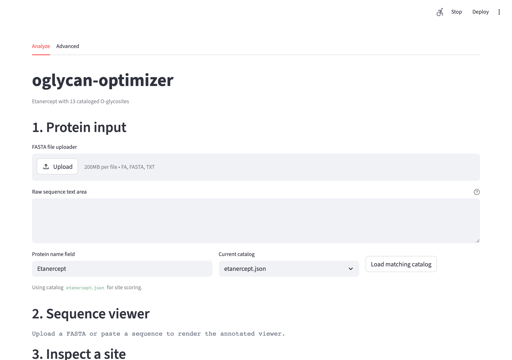

# oglycan-optimizer

**Screenshot**


**Problem** Open glycoproteomics tools usually start after raw data already exists. What is missing is a practical way to choose O-glycopeptide acquisition settings before the run, instead of relying on trial-and-error or vendor defaults.

**Approach**
- Score a glycoprotein site catalog with literature-grounded sub-models for fragmentation, acquisition, chromatography, enzyme effects, and search quality.
- Compose those sub-models into one composite objective for method tuning against a specific site catalog.
- Support pilot-data ingestion, recalibration from observed localization evidence, and constrained next-run recommendations.
- Export a method card for bench transcription and offer an optional Streamlit UI.

**Key results**
- The v1.1 README describes a tool that tunes 6 instrument and workflow parameters with zero dependencies. [Source: /Users/di/Projects/oglycan-optimizer/README.md]
- v1.1 adds 5 reference catalogs: Etanercept, EPO, CTLA4-Ig, IgA1 hinge, and atacicept. [Source: /Users/di/Projects/oglycan-optimizer/README.md]
- The scoring stack is organized as 6 focused sub-models, each described as under 80 LOC and unit-tested independently. [Source: /Users/di/Projects/oglycan-optimizer/README.md]
- The site-catalog schema expects intrinsic difficulty values in the 0.4-0.9 range, and the reference `sites/etanercept.json` covers 13 published sites. [Source: /Users/di/Projects/oglycan-optimizer/README.md]

**Reproduce**
```bash
python -m oglycan tune sites/etanercept.json
```

**Status** `shipped`

**Links**
- GitHub: https://github.com/susiefirst-maker/oglycan-optimizer
- Portfolio: TODO
